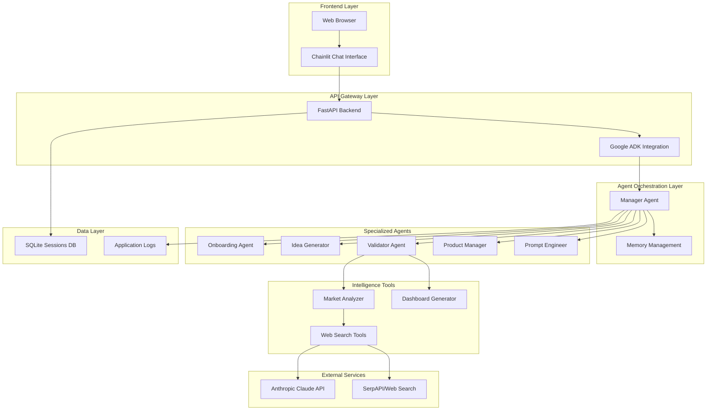
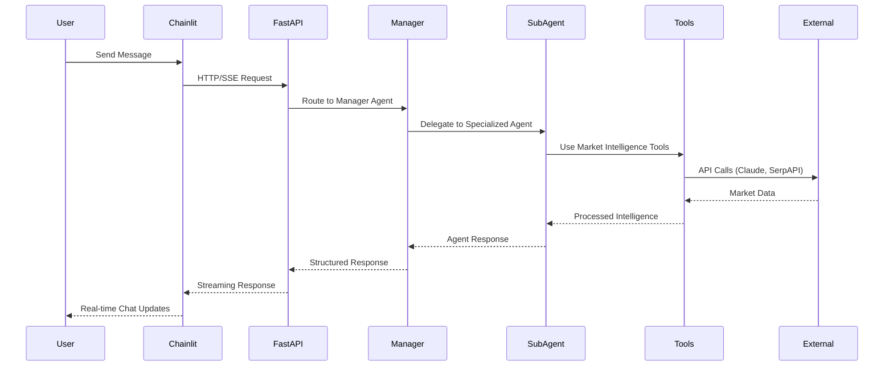

# Design Document

## Overview

VentureBots is designed as a sophisticated multi-agent AI coaching platform that orchestrates specialized AI agents to guide users through the complete entrepreneurship journey. The system leverages Google's Agent Development Kit (ADK) for agent orchestration, Anthropic's Claude for natural language processing, and Chainlit for the conversational interface. The architecture emphasizes modularity, scalability, and educational value while providing real-time market intelligence and comprehensive product development guidance.

## Architecture

### High-Level System Architecture



### Agent Communication Flow



## Components and Interfaces

### Frontend Components

#### Chainlit Chat Interface
- **Purpose**: Provides conversational UI for user interactions
- **Key Features**:
  - Real-time streaming responses with character-by-character display
  - Session persistence and chat history
  - Connection monitoring with intelligent error handling
  - Mobile-responsive design
  - Typing indicators and loading states

#### Session Management
- **Purpose**: Handles user session lifecycle and state persistence
- **Key Features**:
  - Unique session ID generation
  - Session state initialization and recovery
  - Connection retry mechanisms
  - Graceful error handling and user feedback

### Backend Components

#### FastAPI Application Server
- **Purpose**: Serves as the main API gateway and ADK integration point
- **Key Features**:
  - RESTful API endpoints for agent communication
  - Server-Sent Events (SSE) for streaming responses
  - Health check and monitoring endpoints
  - CORS configuration for cross-origin requests
  - Environment-based configuration management

#### Google ADK Integration
- **Purpose**: Provides agent orchestration and lifecycle management
- **Key Features**:
  - Agent registration and discovery
  - Message routing and memory management
  - Session state persistence
  - Multi-agent workflow coordination

### Agent Architecture

#### Manager Agent (Root Orchestrator)
- **Purpose**: Central coordinator that routes requests to specialized agents
- **Responsibilities**:
  - User request analysis and routing
  - Memory state management across agents
  - Workflow progression control
  - Error handling and fallback mechanisms
- **Memory Management**:
  - `user_input`: Current user message
  - `IdeaCoach`: Generated ideas list
  - `SelectedIdea`: User-selected idea for validation
  - `Validator`: Market validation results
  - `PRD`: Product requirements document
  - `BuilderPrompt`: Final implementation prompt

#### Onboarding Agent
- **Purpose**: Collects user profile information and preferences
- **Key Features**:
  - Structured onboarding flow with required/optional fields
  - Timeout handling with configurable retry attempts
  - User data validation and persistence
  - Personalization based on collected information
- **Data Collection**:
  - Name (required)
  - Interests, hobbies, activities (optional)
  - Industry preferences and experience level

#### Idea Generator Agent
- **Purpose**: Generates innovative business ideas based on user profile
- **Key Features**:
  - Configurable idea generation (default: 5 ideas)
  - BADM 350 technical concept integration
  - Market-aware suggestion algorithms
  - Structured idea presentation and selection
- **Technical Concepts Integration**:
  - Value & Productivity Paradox
  - IT as Competitive Advantage
  - E-Business Models and Network Effects
  - Crowd-sourcing and Data-driven value
  - Web 2.0/3.0 and Software as a Service

#### Validator Agent
- **Purpose**: Provides comprehensive market validation and intelligence
- **Key Features**:
  - Real-time web search using Claude's capabilities
  - Multi-dimensional scoring algorithm
  - Advanced market intelligence extraction
  - Rich visual dashboard generation
  - Circuit breaker pattern for reliability
- **Scoring Dimensions**:
  - Market Opportunity (0-1.0)
  - Competitive Landscape (0-1.0)
  - Execution Feasibility (0-1.0)
  - Innovation Potential (0-1.0)
  - Overall Score (weighted average)
  - Analysis Confidence (0-1.0)

#### Product Manager Agent
- **Purpose**: Guides users through comprehensive PRD creation
- **Key Features**:
  - Structured PRD generation with standard sections
  - Technical concept integration in product planning
  - Iterative refinement capabilities
  - JSON storage with readable presentation
- **PRD Structure**:
  - Overview and value proposition
  - Target user personas
  - User stories and acceptance criteria
  - Functional and non-functional requirements
  - Success metrics and KPIs

#### Prompt Engineer Agent
- **Purpose**: Creates optimized prompts for no-code app builders
- **Key Features**:
  - Frontend-focused prompt generation (up to 10,000 tokens)
  - Platform optimization for Bolt.new and Lovable
  - Responsive design and modern UI/UX specifications
  - Component-based architecture definitions
- **Prompt Specifications**:
  - Screen definitions and layouts
  - User flow specifications
  - UI component definitions
  - Technical integration requirements

### Intelligence Tools

#### Market Analyzer
- **Purpose**: Provides advanced market intelligence analysis
- **Key Features**:
  - Multi-dimensional scoring algorithms
  - Structured market intelligence parsing
  - Competitor analysis and positioning
  - Market gap identification
  - Trend analysis and barrier assessment
- **Analysis Components**:
  - TAM (Total Addressable Market) estimation
  - Growth rate analysis
  - Market stage classification
  - Competitive landscape mapping
  - Strategic recommendations generation

#### Dashboard Generator
- **Purpose**: Creates rich visual analysis dashboards
- **Key Features**:
  - Comprehensive market analysis visualization
  - Progress bars and color-coded indicators
  - Competitor analysis with funding/user data
  - Market opportunity and trend identification
  - Strategic recommendations with priority levels
- **Visual Elements**:
  - Score breakdown with progress bars
  - Competitor analysis with position indicators
  - Market gaps and opportunities
  - Trend analysis with timeline information
  - Barrier analysis with severity indicators

#### Web Search Tools
- **Purpose**: Provides real-time market research capabilities
- **Key Features**:
  - Claude-powered web search integration
  - Timeout protection and circuit breaker patterns
  - Structured data extraction from search results
  - Fallback mechanisms for service unavailability
  - Market intelligence parsing and analysis

## Data Models

### User Profile Model
```typescript
interface UserProfile {
  user_id: string;
  session_id: string;
  name: string;
  interests?: string[];
  hobbies?: string[];
  favorite_activities?: string[];
  created_at: timestamp;
  updated_at: timestamp;
}
```

### Idea Model
```typescript
interface Idea {
  id: number;
  idea: string;
  technical_concepts: string[];
  generated_at: timestamp;
}

interface IdeaCollection {
  ideas: Idea[];
  user_profile: UserProfile;
  generation_context: string;
}
```

### Market Validation Model
```typescript
interface MarketScores {
  market_opportunity: number; // 0-1.0
  competitive_landscape: number; // 0-1.0
  execution_feasibility: number; // 0-1.0
  innovation_potential: number; // 0-1.0
  overall_score: number; // 0-1.0
  confidence: number; // 0-1.0
}

interface MarketIntelligence {
  tam_estimate: string;
  growth_rate: string;
  market_stage: 'emerging' | 'growing' | 'mature' | 'declining';
  competitors: Competitor[];
  market_gaps: MarketGap[];
  trends: MarketTrend[];
  barriers: EntryBarrier[];
  recommendations: StrategicRecommendation[];
}

interface ValidationResult {
  idea: Idea;
  scores: MarketScores;
  intelligence: MarketIntelligence;
  dashboard: string;
  validated_at: timestamp;
}
```

### Product Requirements Model
```typescript
interface PRD {
  overview: string;
  value_proposition: string;
  target_users: UserPersona[];
  user_stories: UserStory[];
  functional_requirements: string[];
  nonfunctional_requirements: string[];
  success_metrics: string[];
  technical_concepts: string[];
  created_at: timestamp;
}

interface UserPersona {
  name: string;
  description: string;
  needs: string[];
}

interface UserStory {
  role: string;
  want: string;
  benefit: string;
  acceptance_criteria: string[];
}
```

### Implementation Prompt Model
```typescript
interface BuilderPrompt {
  prompt_text: string;
  target_platform: 'bolt.new' | 'lovable' | 'generic';
  token_count: number;
  screens: ScreenDefinition[];
  components: ComponentDefinition[];
  user_flows: UserFlow[];
  technical_specs: TechnicalSpecification[];
  generated_at: timestamp;
}
```

## Error Handling

### Circuit Breaker Pattern
- **Purpose**: Prevents system overload during external service failures
- **Implementation**:
  - Failure threshold: 3 consecutive failures
  - Recovery timeout: 60 seconds
  - Automatic reset on successful operations
  - Graceful degradation with fallback responses

### Timeout Management
- **Web Search Operations**: 30-second maximum timeout
- **Agent Response Generation**: 120-second timeout with retries
- **User Input Collection**: 300-second timeout with retry mechanisms
- **API Calls**: Configurable timeouts per service

### Graceful Degradation
- **Web Search Failures**: Fallback to basic scoring algorithms
- **Market Intelligence Unavailable**: Default moderate scoring with disclaimers
- **Agent Failures**: Error messages with recovery suggestions
- **Memory Corruption**: Session reset with user notification

### Error Recovery Strategies
- **Automatic Retries**: Up to 3 attempts for transient failures
- **User Notification**: Clear error messages with actionable guidance
- **Fallback Mechanisms**: Alternative processing paths for critical failures
- **Session Recovery**: Ability to resume from last known good state

## Testing Strategy

### Unit Testing
- **Agent Functionality**: Individual agent behavior validation
- **Market Analysis**: Scoring algorithm accuracy and edge cases
- **Data Models**: Serialization/deserialization and validation
- **Utility Functions**: Helper function correctness and error handling

### Integration Testing
- **Agent Communication**: Multi-agent workflow validation
- **External API Integration**: Claude and SerpAPI connectivity
- **Database Operations**: Session persistence and retrieval
- **Memory Management**: Cross-agent data sharing

### System Testing
- **End-to-End Workflows**: Complete user journey validation
- **Performance Testing**: Response time and throughput measurement
- **Load Testing**: Concurrent user handling capabilities
- **Reliability Testing**: Error recovery and graceful degradation

### Test Automation
- **Import Validation**: `test_imports.py` for dependency verification
- **Market Analysis**: `test_enhanced_analysis.py` for intelligence tools
- **Validator Agent**: `test_validator_agent.py` for validation workflows
- **Live System**: `test_live_system.py` for end-to-end integration

### Monitoring and Observability
- **Application Logging**: Structured logging with configurable levels
- **Health Checks**: Endpoint monitoring for system status
- **Performance Metrics**: Response time and error rate tracking
- **User Analytics**: Session duration and workflow completion rates

## Security Considerations

### API Key Management
- **Environment Variables**: Secure storage of sensitive credentials
- **Key Rotation**: Support for API key updates without downtime
- **Access Control**: Principle of least privilege for external services

### Data Privacy
- **Session Isolation**: User data separation and access control
- **Data Retention**: Configurable session data lifecycle management
- **PII Protection**: Anonymization of personally identifiable information

### Input Validation
- **User Input Sanitization**: Protection against injection attacks
- **Rate Limiting**: Prevention of abuse and resource exhaustion
- **Content Filtering**: Inappropriate content detection and handling

## Deployment Architecture

### Container Strategy
- **Single Container**: Simplified deployment with frontend + backend
- **Multi-Service**: Optional separation for scalability
- **Database**: SQLite for development, PostgreSQL for production
- **Reverse Proxy**: Nginx for production load balancing

### Environment Configuration
- **Development**: Local setup with hot reloading
- **Staging**: Production-like environment for testing
- **Production**: Scalable deployment with monitoring and logging

### Scalability Considerations
- **Horizontal Scaling**: Multiple container instances with load balancing
- **Database Scaling**: Connection pooling and read replicas
- **Caching Strategy**: Redis for session management at scale
- **CDN Integration**: Static asset delivery optimization