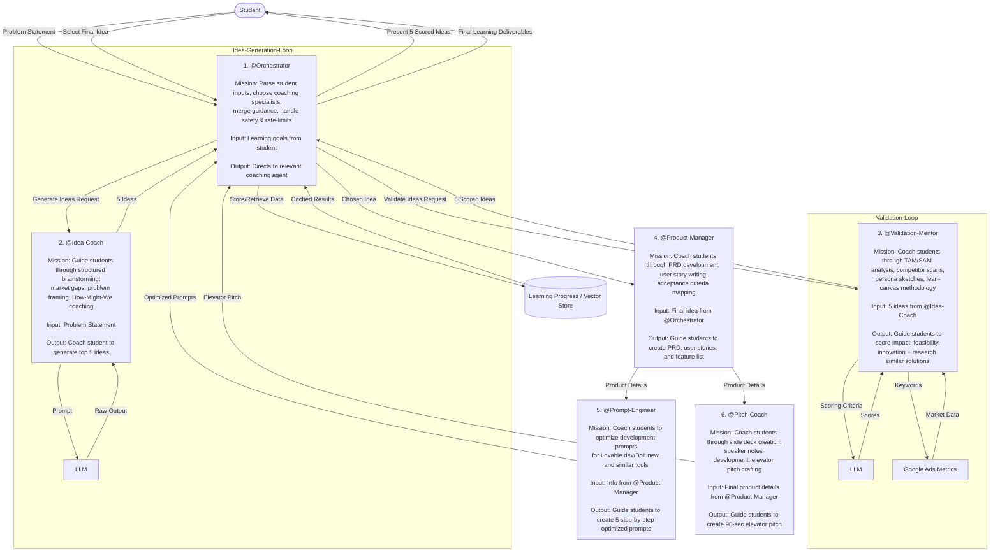

# VentureBots: AI-Powered Entrepreneurship Coaching Workflow

VentureBots guides students through the entrepreneurship journey using specialized AI coaches developed by VentureBot at Gies College of Business.

