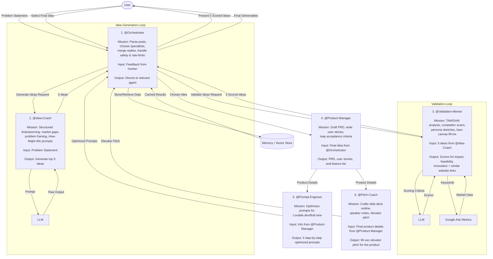

```mermaid
%%{init: {'flowchart': {'useHtmlLabels': true}}}%%
flowchart TD
    User([User]) -->|Problem Statement| Node1
    
    Node1[1. @Orchestrator<br><br>Mission: Parse posts, choose specialists,<br>merge replies, handle safety & rate-limits<br><br>Input: Feedback from human<br><br>Output: Directs to relevant agent] -->|Store/Retrieve Data| Memory[(Memory / Vector Store)]
    Memory -->|Cached Results| Node1
    
    subgraph Idea-Generation-Loop
        Node1 -->|Generate Ideas Request| Node2[2. @Idea-Coach<br><br>Mission: Structured brainstorming: market gaps,<br>problem framing, How-Might-We prompts<br><br>Input: Problem Statement<br><br>Output: Generate top 5 ideas]
        Node2 -->|Prompt| LLM1[LLM]
        LLM1 -->|Raw Output| Node2
        Node2 -->|5 Ideas| Node1
    end
    
    subgraph Validation-Loop
        Node1 -->|Validate Ideas Request| Node3[3. @Validation-Mentor<br><br>Mission: TAM/SAM analysis, competitor scans,<br>persona sketches, lean-canvas fill-ins<br><br>Input: 5 ideas from @Idea-Coach<br><br>Output: Scores for impact, feasibility,<br>innovation + similar website links]
        Node3 -->|Scoring Criteria| LLM2[LLM]
        Node3 -->|Keywords| GoogleAds[Google Ads Metrics]
        GoogleAds -->|Market Data| Node3
        LLM2 -->|Scores| Node3
        Node3 -->|5 Scored Ideas| Node1
    end
    
    Node1 -->|Present 5 Scored Ideas| User
    User -->|Select Final Idea| Node1
    
    Node1 -->|Chosen Idea| Node4[4. @Product-Manager<br><br>Mission: Draft PRD, write user stories,<br>map acceptance criteria<br><br>Input: Final idea from @Orchestrator<br><br>Output: PRD, user stories, and feature list]
    
    Node4 -->|Product Details| Node5[5. @Prompt-Engineer<br><br>Mission: Optimizes prompts for Lovable.dev/Bolt.new<br><br>Input: Info from @Product-Manager<br><br>Output: 5 step-by-step optimized prompts]
    
    Node4 -->|Product Details| Node6[6. @Pitch-Coach<br><br>Mission: Crafts slide deck outline,<br>speaker notes, elevator pitch<br><br>Input: Final product details from @Product-Manager<br><br>Output: 90-sec elevator pitch for the product]
    
    Node5 -->|Optimized Prompts| Node1
    Node6 -->|Elevator Pitch| Node1
    
    Node1 -->|Final Deliverables| User
```